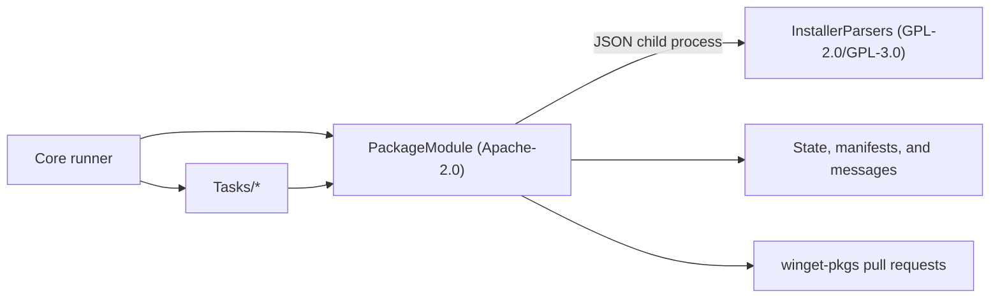

# Dumplings

Dumplings is a PowerShell automation project for monitoring Windows package releases, updating package state, generating and validating WinGet manifests, and submitting changes to [microsoft/winget-pkgs](https://github.com/microsoft/winget-pkgs).

The repository contains thousands of independent package tasks backed by a concurrent runner, static installer analyzers, manifest tooling, notification transports, and GitHub submission support.

## Features

- Runs selected or all package tasks with explicit dependency ordering and configurable concurrency.
- Compares releases with persisted task state and distinguishes new, changed, updated, and rollback states.
- Detects and statically analyzes many Windows installer and bootstrapper formats.
- Reads, updates, formats, and validates multi-file WinGet manifests without invoking `winget validate`.
- Writes task state, sends queued Telegram or Matrix notifications, and submits guarded pull requests.
- Keeps GPL installer implementations behind a JSON child-process boundary from the Apache-2.0 PackageModule.

## Architecture



| Path | Responsibility |
| --- | --- |
| [`Core`](Core/README.md) | Task discovery, dependency planning, worker coordination, hooks, timeouts, and synchronization. |
| [`Modules/PackageModule`](Modules/PackageModule/README.md) | Package task model, release helpers, installer analysis, WinGet manifest processing, messaging, and submission. |
| [`Modules/InstallerParsers`](Modules/InstallerParsers/README.md) | Process-isolated static parsers for formats whose implementations use GPL-compatible licenses. |
| `Tasks` | One directory per automation task, containing `Config.yaml`, `Script.ps1`, and persisted state. |
| [`.agents/skills`](.agents/skills) | Workflow documentation for installer analysis and WinGet manifest authoring. |
| `Utilities` | Repository maintenance and GitHub Actions support scripts. |

`Core`, `PackageModule`, and `InstallerParsers` are Git submodules and are also usable as independently versioned projects.

## Requirements

- Windows
- [PowerShell](https://github.com/PowerShell/PowerShell) 7.4 or later
- Git with submodule support
- Network access for release checks and installer downloads
- GitHub credentials, and optionally a local `winget-pkgs` checkout, only when submission is enabled

The runner installs missing PowerShell modules declared in `Preference.yaml`. GitHub Actions uses the pinned versions in [`PowerShellModules.psd1`](PowerShellModules.psd1) and caches them between runs. The optional browser helper similarly restores the Apache-2.0 Patchright runtime pinned by [`PlaywrightRuntime.psd1`](Modules/PackageModule/Assets/PlaywrightRuntime.psd1); its large version-coupled driver payload is cached outside Git rather than committed.

## Getting Started

Clone the repository and all submodules:

```powershell
git clone --recurse-submodules https://github.com/SpecterShell/Dumplings.git
Set-Location .\Dumplings
```

If the repository was cloned without submodules:

```powershell
git submodule update --init --recursive
```

Run one task without enabling state writes, messages, or submissions:

```powershell
.\Core\Index.ps1 -Name Adobe.WorkfrontProof
```

Run several tasks with four workers:

```powershell
.\Core\Index.ps1 -Name Adobe.WorkfrontProof, Mozilla.Firefox -ThrottleLimit 4
```

Run every task:

```powershell
.\Core\Index.ps1
```

Arguments not owned by `Core\Index.ps1` override values from `Preference.yaml`. Common operational switches are:

```powershell
# Re-evaluate a task regardless of its persisted state.
.\Core\Index.ps1 -Name Vendor.Package -Force

# Persist State.yaml and a timestamped log after a detected change.
.\Core\Index.ps1 -Name Vendor.Package -EnableWrite

# Exercise manifest generation and submission logic without opening a PR.
.\Core\Index.ps1 -Name Vendor.Package -Force -EnableSubmit -Dry
```

`-EnableMessage` and non-dry `-EnableSubmit` perform external side effects. Enable them only after configuring their credentials and reviewing the selected tasks.

## Configuration

[`Preference.yaml`](Preference.yaml) contains non-secret runner and module defaults. Command-line overrides have higher priority.

Secrets are loaded in this order:

1. YAML from the `DUMPLINGS_SECRET` environment variable.
2. Values from the ignored local `Secret.yaml` file, which override matching environment values.

The runner also reads an ignored `.env` file without replacing environment variables that already exist. Never commit `.env`, `Secret.yaml`, tokens, cookies, or installer credentials.

Common environment variables include:

| Variable | Purpose |
| --- | --- |
| `GH_DUMPLINGS_TOKEN`, `GITHUB_TOKEN` | GitHub API, repository, and submission authentication. |
| `TG_BOT_TOKEN`, `TG_CHAT_ID` | Optional Telegram notifications. |
| `MT_BOT_TOKEN`, `MT_ROOM_ID` | Optional Matrix notifications. |
| `DUMPLINGS_SECRET` | Additional task-specific secrets encoded as YAML. |

## Task Layout

A task directory is selected only when it contains `Config.yaml`. A typical package task starts with:

```yaml
Type: PackageTask
WinGetIdentifier: Vendor.Package
Skip: false
```

`Script.ps1` populates `$this.CurrentState`, calls `$this.Check()`, and conditionally uses `$this.Print()`, `$this.Write()`, `$this.Message()`, and `$this.Submit()`. `State.yaml` points to the most recent timestamped state log and is read on the next run.

Dependencies must be explicit:

```yaml
DependsOn:
- '#Vendor'
```

Tasks whose names begin with `#` commonly populate `$Global:DumplingsStorage` for dependent package tasks. Core validates declared dependencies, orders them deterministically, and blocks dependents whose providers fail.

Use nearby tasks from the same publisher as implementation references, but verify their current behavior rather than copying assumptions.

## Authoring Documentation

- [`analyze-winget-installer`](.agents/skills/analyze-winget-installer/SKILL.md) covers static installer detection, parser routing, Apps & Features evidence, and isolated VM validation.
- [`author-winget-manifest`](.agents/skills/author-winget-manifest/SKILL.md) covers official source discovery, manifest fields, localization, automation, validation, and submission.

These workflows are the canonical detailed guidance. The READMEs intentionally focus on repository and API operation.

## Testing

Run the component suites from the repository root:

```powershell
Invoke-Pester .\Core\Tests
Invoke-Pester .\Modules\PackageModule\Tests
Invoke-Pester .\Modules\InstallerParsers\Tests
```

Run ScriptAnalyzer on a changed module when available:

```powershell
Invoke-ScriptAnalyzer .\Modules\PackageModule\Libraries\Example.psm1
```

Installer fixtures are cached outside user download and temporary directories. Tests must not execute installers.

## License

The root project remains licensed under the [MIT License](LICENSE). Core and PackageModule use the [Apache License 2.0](Core/LICENSE) and [Apache License 2.0](Modules/PackageModule/LICENSE), respectively. PackageModule contains documented file-level MIT and third-party exceptions. InstallerParsers has file-specific GPL licensing described in its [README](Modules/InstallerParsers/README.md).
